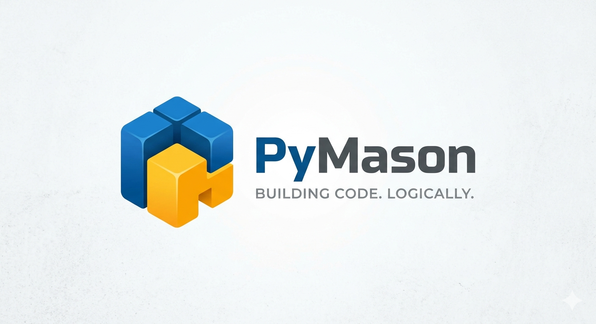

# PyMason

**Building Code. Logically.**

A visual, block-based Python builder powered by [Google Blockly](https://developers.google.com/blockly). Drag blocks, get real Python in real time, and run it in the browser with Pyodide.

### Start here (humans & AIs)

1. **[SOUL.md](SOUL.md)** — Empire constitution (how work must be delivered)  
2. **[AGENTS.md](AGENTS.md)** — Project onboarding pointer  
3. **[PYMASON_VISION.md](PYMASON_VISION.md)** — Product vision  
4. `npm test` after any change



## What it is

PyMason sits between Scratch-style visual coding and a real Python environment:

- **Beginners / ND learners** — no blank-page syntax wall; generated code teaches by osmosis
- **Experienced developers** — sketch control flow and algorithms visually, then copy or download `.py`

## Quick start

### Browser (no install)

1. Open `index.html` in a modern browser (Chrome, Edge, Firefox).
2. Drag blocks from the toolbox.
3. Click **Run** (or `Ctrl+Enter`) to execute with Pyodide (loads on first run).

Or open the marketing entry point:

- `landing.html` → links into the full app

### Electron desktop

```bash
cd electron
npm install
npm start
```

Build installers:

```bash
npm run build-win    # Windows
npm run build-mac    # macOS
npm run build-linux  # Linux
```

## Features (v1.5.0 — stdlib packs + lifelong forge)

| Area | Highlights |
|------|------------|
| **Blocks** | ~250 generators · 32 categories: fundamentals, Stage, **Time/Random/Path/Regex/Bitwise/Advanced**, **Collections/Stats/Encode/Text+/Itertools**, Web & Concurrency *sketches* |
| **Dual surface** | **Blocks→Code** live sync *or* **Free Python** editor (Run uses active mode); Dual + →Blocks |
| **Debugger** | Line/block breakpoints, worker SAB + main fallback, Step/Cont, live locals |
| **Execution** | Pyodide, stage canvas, run history, micropip packages |
| **AI agent** | Multi-provider chat + **Apply workspace JSON** (Agent Apply) |
| **Projects** | Multi-module tabs, download all `.py`, portfolio package, share links |
| **Learning** | Examples, Bridge practice, syntax coach, curriculum autograde, Learner→Career path |
| **Classroom** | Roster, assignments, gradebook, student mode, Core toolbox lock |
| **Pro UX** | Command palette (`Ctrl+K`), minimap, WPAI forge UI + login |

## Keyboard shortcuts

| Shortcut | Action |
|----------|--------|
| `Ctrl+Enter` | Run |
| `Ctrl+S` | Save workspace |
| `Ctrl+Shift+S` | Export JSON |
| `Ctrl+D` | Download `.py` |
| `Ctrl+F` | Search blocks |
| `Ctrl+0` | Zoom to fit |
| `Ctrl+Shift+L` | Copy share link |
| `Ctrl+C` | Copy Python (no block selected) |
| `F1` | Help & reference |
| `Esc` | Close flyout / dialogs |

## Project layout

```
PyMason/
├── index.html          # Full application (single file)
├── landing.html        # Marketing / entry page
├── PyMason.png         # Branding
├── electron/           # Desktop wrapper
├── docs/               # User guide, FAQ, block reference
├── PYMASON_VISION.md   # Product vision & roadmap
├── PYMASON_TODO.md     # Task checklist
└── CHANGELOG.md
```

## Design principles

1. **Teaches by doing** — using the tool *is* the tutorial  
2. **No dead ends** — if Python can do it, there should be a block path  
3. **One file, zero friction** — open HTML and build  
4. **Professional aesthetic** — leather & brass, not a kids' toy  
5. **Respect time** — auto-save, shortcuts, recoverable work  

## Tests

```bash
cd tests && npm install && npx playwright install chromium
npm test                 # from repo root or tests/
# SKIP_BROWSER=1 npm test
# UPDATE_FIXTURES=1 npm test   # refresh tests/fixtures/examples/*.py
```

Smoke suite (`tests/smoke.mjs`):

| Tier | What it checks |
|------|----------------|
| A | CDN pins, block/generator/toolbox integrity, example keys |
| B | Headless `blockToCode` for all custom types, goldens, save/load |
| C | All 10 EXAMPLE builders → Python + fixtures + serialize |
| D | Required DOM IDs and core functions present |
| E | Playwright: page load, Blockly inject, Hello World via UI |
| F | Pyodide: **Run** Hello World, assert Output contains Hello |

## Documentation

- [User Guide](docs/user-guide.md)
- [FAQ](docs/faq.md)
- [Block Reference](docs/block-reference.md)
- [Hosting & deploy](docs/hosting.md)
- [Audit report](AUDIT.md)
- [Vision & Roadmap](PYMASON_VISION.md)
- [Changelog](CHANGELOG.md)

## License

© 2026 Wizard Productions AI Studio. All Rights Reserved.

UNLICENSED / private — intended for paid Electron distribution (e.g. Gumroad) with a free web demo. No license is granted to copy, modify, or redistribute except as expressly allowed by Wizard Productions AI Studio.
